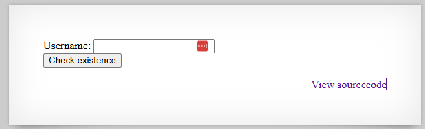
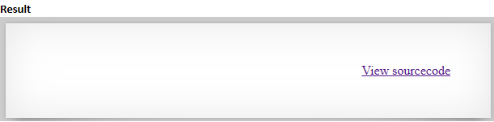
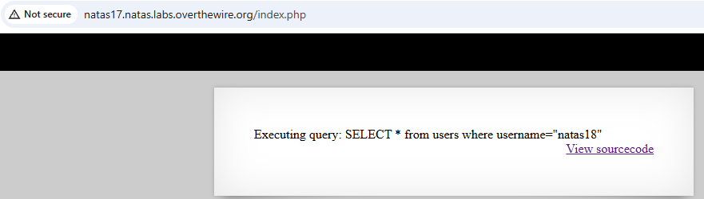
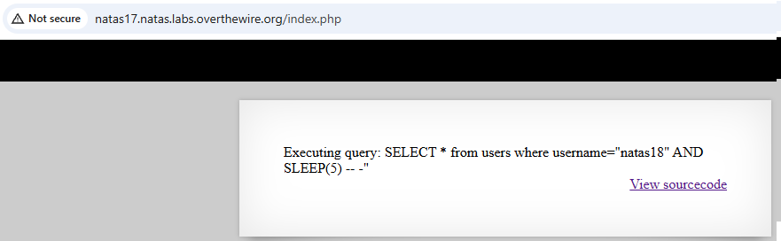
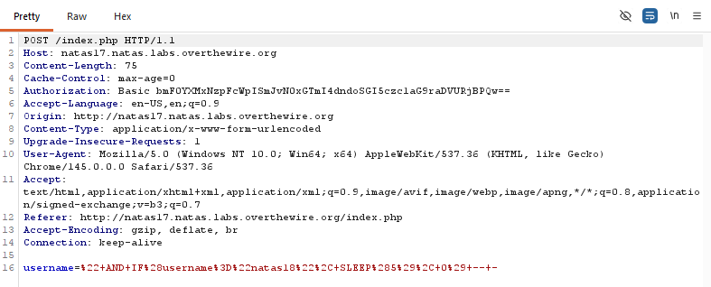
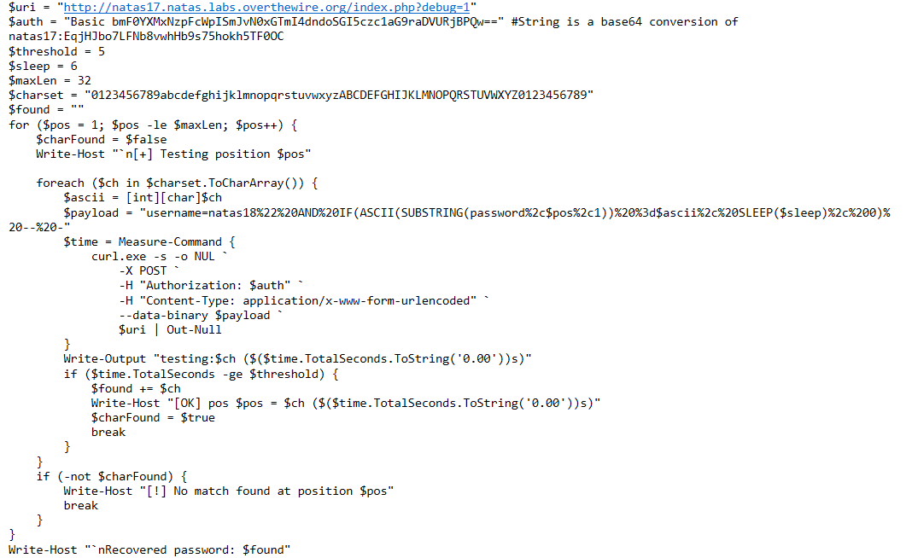
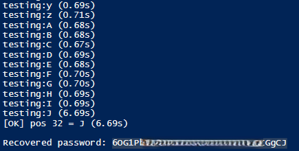

# Natas Level 17 → Level 18

## Level Goal / Objective

Find the password for the next level.

🔗 https://overthewire.org/wargames/natas/natas17.html

## Tools You May Need

```text
Browser DevTools, Burp Suite, PowerShell
```

## Concept Focus

* Time-based blind SQL injection
* Boolean inference through response timing
* Automated enumeration

## Approach

### 1. Access the Level

Navigate to:

```text
http://natas17.natas.labs.overthewire.org/
```

Authenticate using:

```text
Username: natas17
Password: <previous level password>
```

---

### 2. Initial Enumeration

Reviewing the source code shows a SQL query is being executed, but normal searches return a blank result page rather than useful output.

This suggests the application may still be injectable, but without visible query results.

---

### 3. Investigate Further

Appending `?debug=1` to the URL reveals the query being executed when submitting input:

```text
http://natas17.natas.labs.overthewire.org/index.php?debug=1
```

This confirms the username field is being inserted into a backend SQL query.

---

### 4. Confirm Time-Based Injection

A time-based payload can be used to confirm SQL injection by delaying the server response:

```text
natas18" AND IF(ASCII(SUBSTRING(password,<POS>,1)) = <ASCII>, SLEEP(5), 0) -- -
```

When the tested condition is true, the page response is delayed.  
When false, the page loads normally.

This creates a reliable side channel for character-by-character enumeration.

---

### 5. Enumerate the Password

I first used Burp Suite Repeater to manually test a few positions and validate the technique.

To speed up the rest of the enumeration, I used a PowerShell script to:

- iterate through character positions
- test a candidate character set
- measure response time
- record characters that triggered the sleep condition

The working character classes were based on ASCII ranges:

- `48–57` → numbers
- `65–90` → uppercase letters
- `97–122` → lowercase letters

---

### 6. Extract the Password

After automating the timing-based tests, the full password for the next level was recovered.

---

## Walkthrough (Screenshots)















---

## Password for Level 18

```text
6OG1PbKd... (redacted)
```

---

## Key Takeaways

* Blind SQL injection can still be exploited even when no query output is displayed
* Response timing can act as a side channel for extracting data
* Debug functionality can unintentionally expose useful attack surface
* Automation is often necessary for practical blind enumeration
