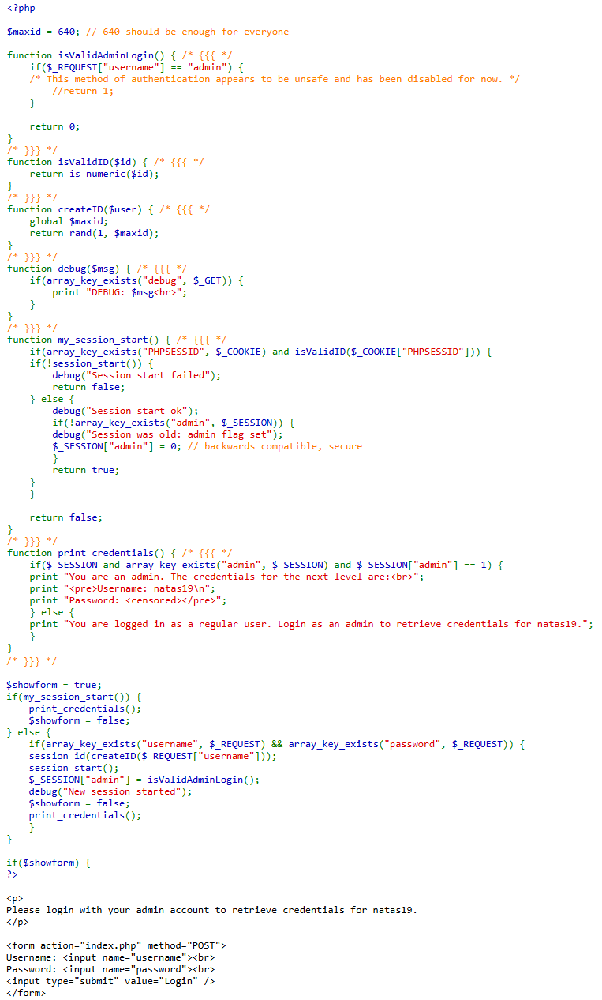
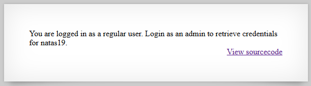
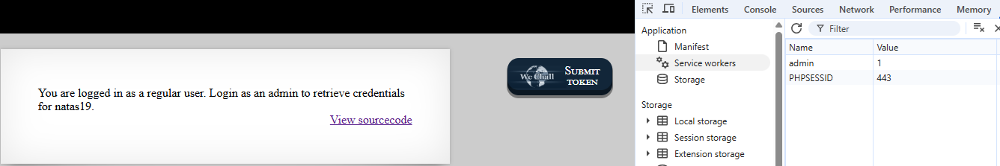
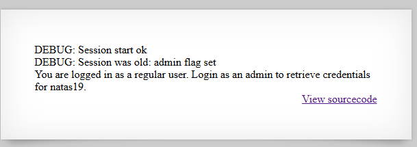
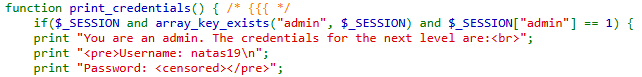
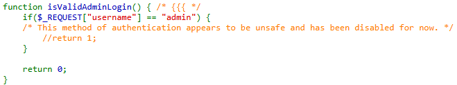
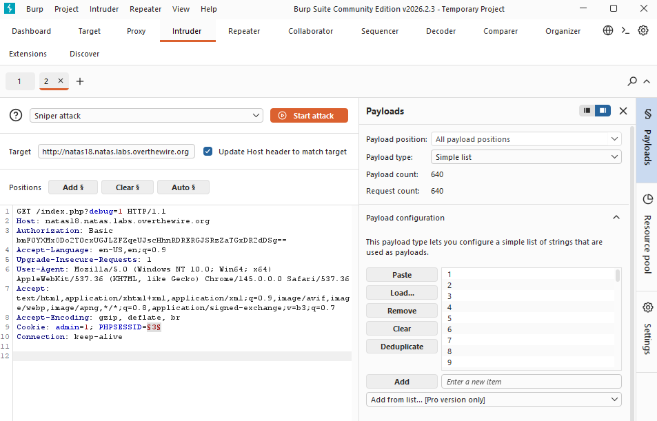

# Natas Level 18 → Level 19

## Level Goal / Objective

Find the password for the next level.

🔗 https://overthewire.org/wargames/natas/natas18.html

## Tools You May Need

```text
Browser DevTools, Burp Suite
```

## Concept Focus

* Session management flaws
* Session ID brute forcing
* Weak randomness / small keyspace

## Approach

### 1. Access the Level

```text
http://natas18.natas.labs.overthewire.org/
```

Authenticate with previous credentials.

---

### 2. Review Source Code

The application uses a PHP session mechanism with:

- `PHPSESSID` cookie
- A maximum session ID range (`1–640`)
- An `admin` flag stored in the session

The login logic for admin is intentionally disabled, so direct login will not work.

---

### 3. Identify Weakness

Key observation:

- Session IDs are numeric and bounded (≤ 640)
- If a session exists where `admin=1`, we can reuse it

This reduces the problem to brute forcing session IDs.

---

### 4. Enable Debug Output

Appending:

```text
?debug=1
```

Provides insight into session handling and confirms when a session is valid.

---

### 5. Brute Force Session IDs

Using Burp Suite Intruder:

- Target the `PHPSESSID` cookie
- Payload: numbers `1 → 640`
- Monitor responses for changes indicating admin access

[number_list_0-640](./number_list_0-640.txt)

---

### 6. Identify Valid Admin Session

One of the requests returns a response indicating:

```text
You are an admin. The credentials for the next level are:
```

This reveals the password.

---

## Walkthrough (Screenshots)















---

## Password for Level 19

```text
tnwER7Pdf... (Redacted)
```

---

## Key Takeaways

* Small session ID spaces are inherently insecure
* Authentication bypass can occur via session reuse
* Brute forcing sessions is practical when entropy is low
* Debug functionality can aid exploitation
