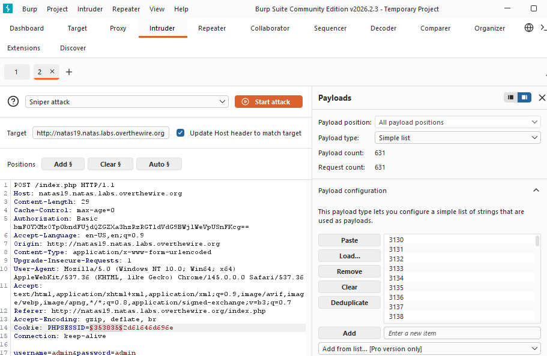
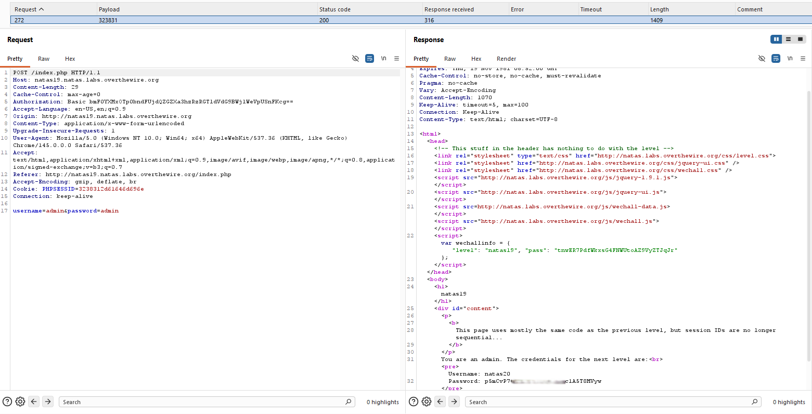

# Natas Level 19 → Level 20

## Level Goal / Objective

Find the password for the next level.

🔗 https://overthewire.org/wargames/natas/natas19.html

## Tools You May Need

```text
Browser DevTools, Burp Suite, CyberChef (optional)
```

## Concept Focus

* Session ID encoding
* Predictable session structure
* Session brute forcing (non-sequential IDs)

## Approach

### 1. Access the Level

```text
http://natas19.natas.labs.overthewire.org/
```

Authenticate with previous credentials.

---

### 2. Understand the Hint

> “This page uses mostly the same code as the previous level, but session IDs are no longer sequential…”

This implies:

- Session IDs are still predictable
- But no longer simple integers

---

### 3. Capture Session IDs

Logging in multiple times reveals values like:

```text
36312d61646d696e
3438362d61646d696e
3433322d61646d696e
```

---

### 4. Identify Encoding Pattern

Observations:

- All values end with: `61646d696e`
- Converting from hex:

```text
61646d696e → admin
```

So session format appears to be:

```text
<id>-admin (hex encoded)
```

Example:

```text
3438362d61646d696e → 486-admin
```

---

### 5. Exploit the Pattern

Instead of sequential integers:

- Convert numbers (1–640) into:

```text
<number>-admin
```

- Then encode the full string as hex
- Use the result as `PHPSESSID`

---

### 6. Brute Force Sessions

Using Burp Suite Intruder:

- Replace `PHPSESSID` with generated values
- Iterate through range
- Look for response indicating admin access

[number_list_0-640-hex](number_list_0-640-hex.txt)

---

### 7. Identify Valid Session

One response returns:

```text
You are an admin. The credentials for the next level are:
```

This reveals the password.

---

## Walkthrough (Screenshots)





---

## Password for Level 20

```text
p5mCvP7G... (Redacted)
```

---

## Key Takeaways

* Encoding does not equal security
* Session structure leaks can lead to full compromise
* Predictable formats are as dangerous as sequential IDs
* Brute forcing remains viable when entropy is low
