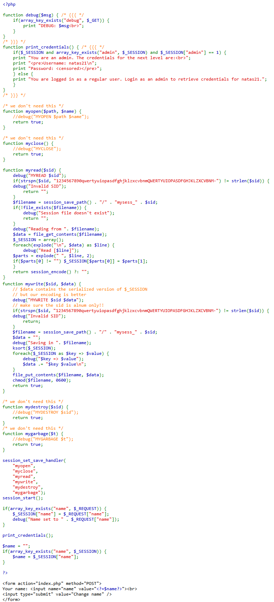
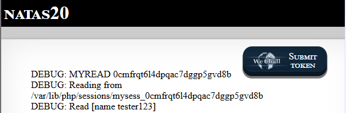
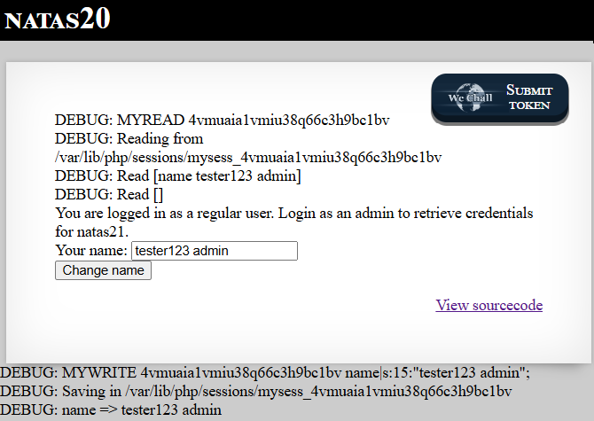
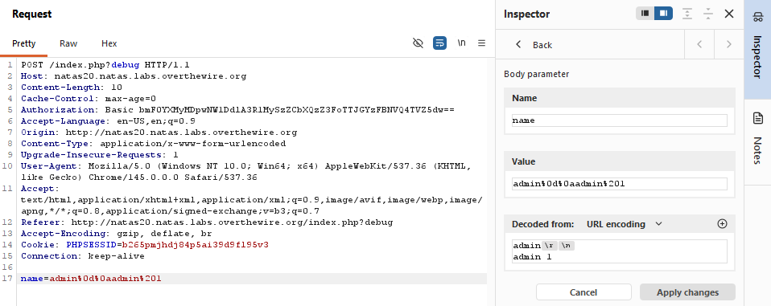
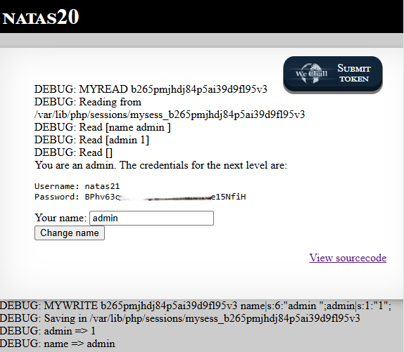

# Natas Level 20 → Level 21

## Level Goal / Objective

Find the password for the next level.

🔗 https://overthewire.org/wargames/natas/natas20.html

## Tools You May Need

```text
Browser DevTools, Burp Suite
```

## Concept Focus

* Session file injection
* Input sanitization flaws
* Server-side parsing vulnerabilities

## Approach

### 1. Access the Level

```text
http://natas20.natas.labs.overthewire.org/
```

Authenticate using previous credentials.

---

### 2. Initial Enumeration

Reviewing the source code shows:

- Session data is written to a file
- User-controlled input (`name`) is stored in session
- No proper sanitization is applied

---

### 3. Enable Debug Output

Appending:

```text
?debug=1
```

Reveals how session data is being processed and stored.

---

### 4. Investigate Input Handling

Testing input behavior:

- Single values → stored normally
- Multiple words → still treated as a single string

However, the session file uses a structured format:

```text
key value
```

---

### 5. Exploit Session Injection

By injecting newline characters, we can break the structure and inject new key/value pairs.

Payload:

```text
admin%0d%0aadmin%201
```

This results in:

```text
admin
admin 1
```

Which sets:

```text
admin = 1
```

in the session.

---

### 6. Gain Admin Access

After submitting the payload and refreshing:

- Application recognizes admin privileges
- Password for next level is revealed

---

## Walkthrough (Screenshots)












---

## Password for Level 21

```text
BPhv63c... (redacted)
```

---

## Key Takeaways

* Improper parsing of user input can lead to session injection
* Newline injection can break structured storage formats
* Server-side session storage must be strictly validated
