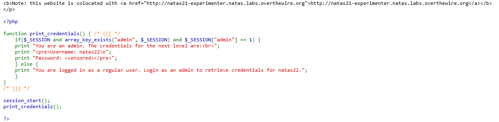
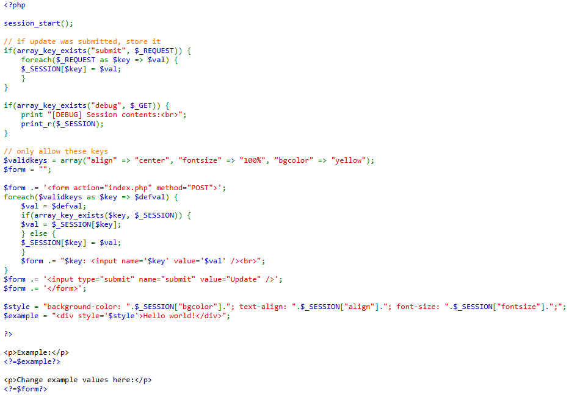
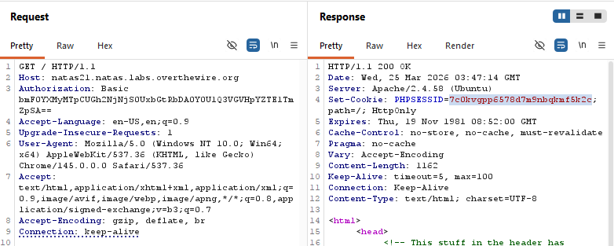
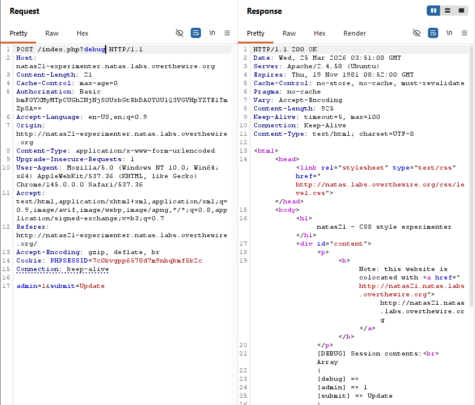
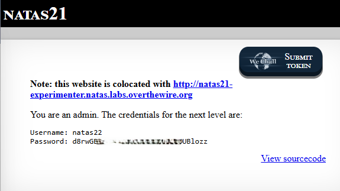

# Natas Level 21 → Level 22

## Level Goal / Objective

Find the password for the next level.

🔗 https://overthewire.org/wargames/natas/natas21.html

## Tools You May Need

```text
Browser DevTools, Burp Suite
```

## Concept Focus

* Cross-application session poisoning
* Shared session identifiers
* Trusting session data across related applications

## Approach

### 1. Access the Level

```text
http://natas21.natas.labs.overthewire.org/
```

Authenticate using previous credentials.

---

### 2. Initial Enumeration

The main site source and page hint indicate that this site is colocated with another application:

```text
http://natas21-experimenter.natas.labs.overthewire.org/
```

The main application checks the session for an `admin` value, but does not provide a direct way to set it.

---

### 3. Investigate the Experimenter Site

Reviewing the experimenter source code shows that it writes arbitrary submitted keys into the session:

```php
foreach($_REQUEST as $key => $val) {
    $_SESSION[$key] = $val;
}
```

With debug enabled, the experimenter also prints session contents. This suggests it can be used to poison the session used by the main site.

---

### 4. Poison the Shared Session

1. Request the main site and capture the `PHPSESSID` cookie.
2. Reuse that same cookie when sending a POST request to the experimenter site.
3. Submit a parameter that sets:

```text
admin=1
```

4. Append `?debug=1` on the experimenter request to confirm the session now contains:

```text
[admin] => 1
```

---

### 5. Extract the Password

After poisoning the session on the experimenter site, return to the main site while keeping the same `PHPSESSID`.

The main site now treats the session as admin and reveals the password for the next level.

---

## Walkthrough (Screenshots)











---

## Password for Level 22

```text
d8rwGBl0... (redacted)
```

---

## Key Takeaways

* Shared session storage between applications can create privilege escalation paths
* One weak application can compromise another if they trust the same session state
* Debug output can confirm session poisoning during testing
