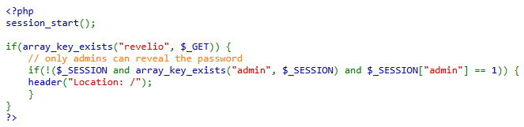
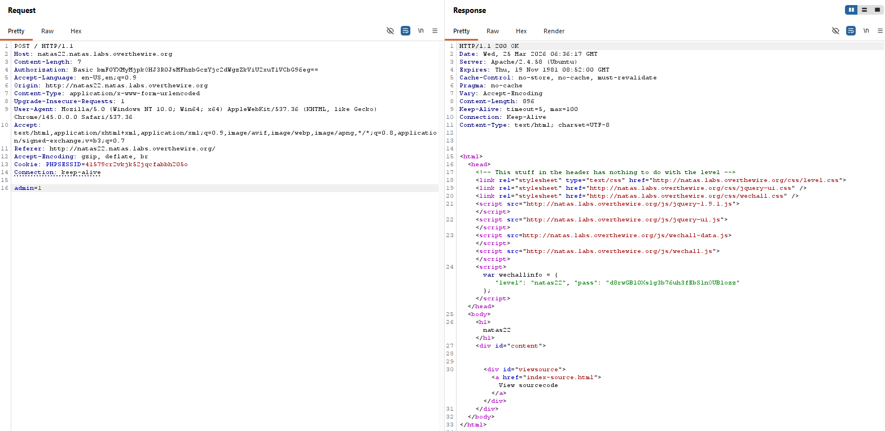
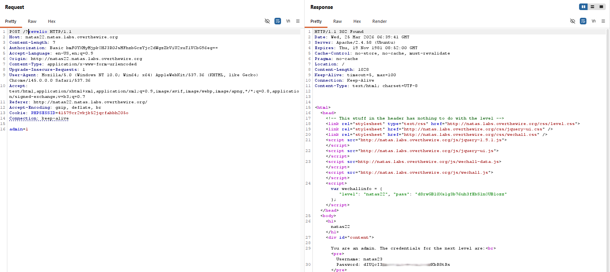

# Natas Level 22 → Level 23

## Level Goal / Objective

Find the password for the next level.

🔗 https://overthewire.org/wargames/natas/natas22.html

## Tools You May Need

```text
Browser DevTools, Burp Suite
```

## Concept Focus

* Parameter-based access control
* Session manipulation
* Request method tampering

## Approach

### 1. Access the Level

```text
http://natas22.natas.labs.overthewire.org/
```

Authenticate using previous credentials.

---

### 2. Initial Enumeration

The source code is minimal, but it reveals two important checks:

1. A request parameter named `revelio` must be present.
2. The session must contain:

```text
admin = 1
```

If the session condition is not met, the application redirects back to `/`.

---

### 3. Investigate Further

There are no visible input fields to interact with, so the next step is to manipulate the request directly.

I started by crafting a POST request to set the session condition manually:

```text
admin=1
```

This alone did not produce useful output.

---

### 4. Satisfy Both Conditions

The missing piece was to combine the POST request with the required GET parameter:

```text
/?revelio
```

Sending a POST request to:

```text
http://natas22.natas.labs.overthewire.org/?revelio
```

while including:

```text
admin=1
```

satisfies both application checks.

---

### 5. Extract the Password

With both conditions met in the same request, the application reveals the password for the next level.

---

## Walkthrough (Screenshots)







---

## Password for Level 23

```text
dIUQcI3... (redacted)
```

---

## Key Takeaways

* Even simple applications can hide exploitable logic in minimal source code
* Access control often depends on combining multiple conditions correctly
* Direct request manipulation is essential when no visible input exists
