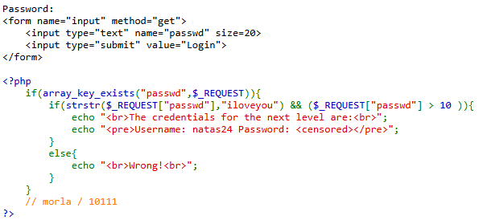
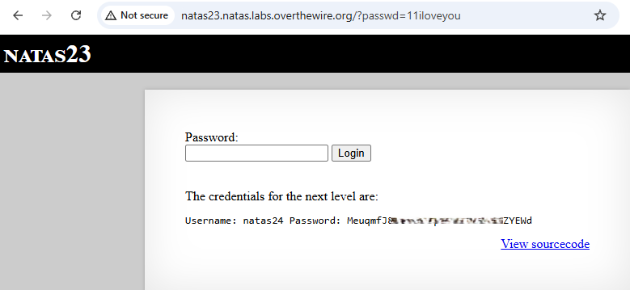

# Natas Level 23 → Level 24

## Level Goal / Objective

Find the password for the next level.

🔗 https://overthewire.org/wargames/natas/natas23.html

## Tools You May Need

```text
Browser DevTools
```

## Concept Focus

* PHP type juggling
* Misuse of string functions
* Logical condition bypass

## Approach

### 1. Access the Level

```text
http://natas23.natas.labs.overthewire.org/
```

Authenticate using previous credentials.

---

### 2. Review Source Code

The relevant logic:

```php
if(strstr($_REQUEST["passwd"], "iloveyou") && ($_REQUEST["passwd"] > 10)){
```

Two conditions must be satisfied:

1. Input must contain `"iloveyou"`
2. Input must be greater than `10`

---

### 3. Investigate Behavior

The `strstr()` function:

- Finds the first occurrence of `"iloveyou"`
- Returns the remaining part of the string from that point onward

The second condition performs a numeric comparison.

---

### 4. Exploit the Logic

By placing a number greater than 10 before `"iloveyou"` satisfies both conditions:

- Contains `"iloveyou"` ✅
- Evaluates as a number greater than `10` ✅

Submitting this reveals the password for the next level.

---

## Walkthrough (Screenshots)





---

## Password for Level 24

```text
MeuqmfJ... (redacted)
```

---

## Key Takeaways

* PHP loosely compares types, leading to unexpected behavior
* String functions can return values that influence logic checks
* Combining conditions incorrectly can introduce bypasses
