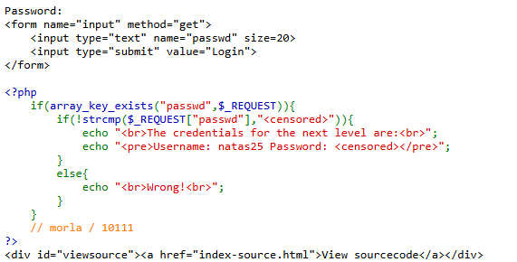
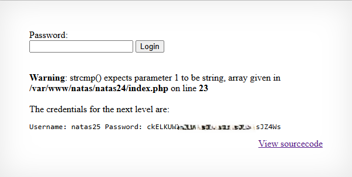

# Natas Level 24 → Level 25

## Level Goal / Objective

Find the password for the next level.

🔗 https://overthewire.org/wargames/natas/natas24.html

## Tools You May Need

```text
Browser DevTools
```

## Concept Focus

* PHP type juggling
* Misuse of strcmp()
* Input type confusion

## Approach

### 1. Access the Level

```text
http://natas24.natas.labs.overthewire.org/
```

Authenticate using previous credentials.

---

### 2. Review Source Code

The relevant logic:

```php
if(array_key_exists("passwd", $_REQUEST)){
    if(!strcmp($_REQUEST["passwd"], "<censored>")){
        // success
    }
}
```

Two key observations:

1. `strcmp()` is used to compare the password
2. The result is negated using `!`

---

### 3. Investigate Behavior

The `strcmp()` function:

- Expects two strings
- Returns `0` when values match

However:

- If an **array** is passed instead of a string, `strcmp()` returns `NULL`
- In PHP:
  ```text
  !NULL = true
  ```

This creates a logic flaw.

---

### 4. Exploit the Logic

By passing an array instead of a string:

```text
http://natas24.natas.labs.overthewire.org/?passwd[]=1
```

This causes:

- `strcmp()` → returns `NULL`
- `!NULL` → evaluates to `true`

Authentication is bypassed.

---

## Walkthrough (Screenshots)





---

## Password for Level 25

```text
ckELKUW... (redacted)
```

---

## Key Takeaways

* PHP type juggling can introduce serious authentication flaws
* Functions expecting specific types must validate input
* Passing unexpected data types can bypass logic checks
